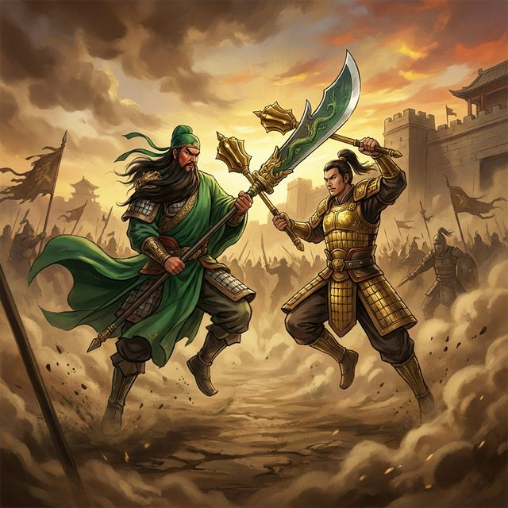

# 关公战秦琼 (Guan Yu vs Qin Qiong)

一个基于 **React** 和 **Vite** 开发的巅峰决战小游戏。穿越时空的限制，让三国武圣关羽与唐代名将秦琼在沙场一决高下，或让诗仙李白与词圣苏轼进行一场文采斐然的“飞花令”对决。



## 🎮 游戏特色

- **多时空阵容**：武圣、门神、诗仙、词圣，提供了文、武两种截然不同的战斗模式。
- **独创战斗引擎**：
  - **武斗系统**：支持多种技能、普通攻击以及位移（跳跃、冲刺、躲闪）。
  - **文斗系统**：水墨风动画配合诗词吟诵，体验独特的精神对战。
- **动态视觉**：基于写实立绘的 CSS3 动作序列与华丽的水墨特效。

## ⌨️ 操作说明

游戏支持双人同屏对战：

### 1P - 关羽 (左侧)
| 按键 | 功能 |
| :--- | :--- |
| **Q / E** | 向后 / 向前移动 |
| **W / R** | 跳跃 / 躲闪 |
| **A / S / D** | 释放技能 (青龙斩 / 威震华夏 / 单刀赴会) |
| **F** | 普通攻击 |

### 2P - 秦琼 (右侧)
| 按键 | 功能 |
| :--- | :--- |
| **U / O** | 向后 / 向前移动 |
| **I / P** | 跳跃 / 躲闪 |
| **H / J / K** | 释放技能 (撒手锏 / 马踏黄河 / 双锏无双) |
| **L** | 普通攻击 |

## 🛠️ 技术栈

- **前端框架**: React (Hooks, Refs)
- **构建工具**: Vite
- **动画/样式**: Vanilla CSS (Keyframe Animations, HSL Colors)
- **图形资源**: 
  - 角色立绘：高质量动态 Pose
  - 打击感：浮动伤害数值与击退效果

## 🚀 快速开始

1. **安装依赖**：
   ```bash
   npm install
   ```

2. **启动开发服务器**：
   ```bash
   npm run dev
   ```

3. **构建生产版本**：
   ```bash
   npm run build
   ```

## 📄 许可证

基于 MIT 协议开源。
